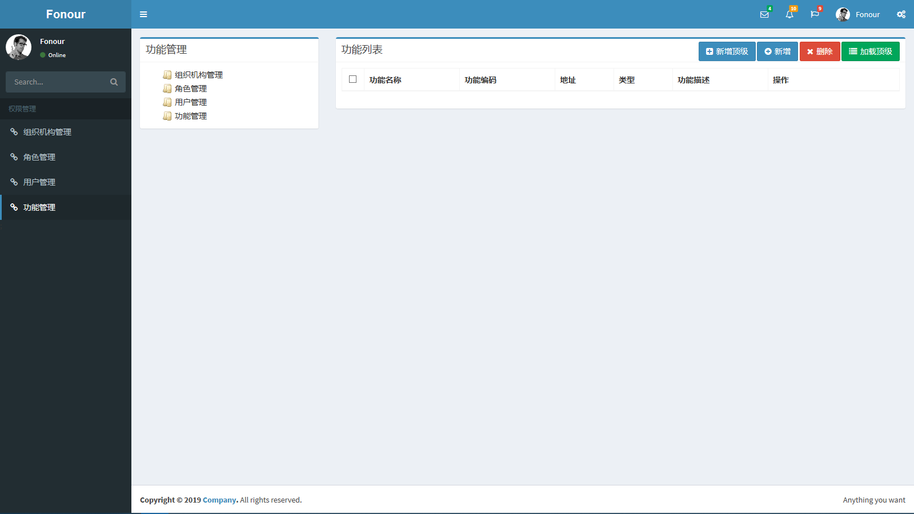

# Asp.Net Core 权限管理系统

## Code First 操作步骤
* 使用程序包管理器控制台(前提安装 ...Sqlsever、...SqlSever.Design )
  * `Add-Migration Init`
  * `Update-DataBase`
  * `Remove-Migration `
* 使用 .NET Core CLI 命令
  * `dotnet ef migrations add init`
  * `dotnet ef database update`*

## 项目展示
* 登录界面
    
* 欢迎界面
    
* 组织管理界面
    
* 角色管理界面
    
* 用户管理界面
    
* 菜单管理界面
    

## 常见问题
### 1.[在 Visual Studio 2017 中使用 Bower 管理前端框架](https://blog.csdn.net/qq_33303204/article/details/81323512)
### 2.[Asp.net Core 读取配置文件 - appsettings.json](https://www.cnblogs.com/yuangang/p/5736892.html)
### 3.[EF Core 迁移过程遇到EF Core tools version版本不相符的解决方案](https://www.cnblogs.com/duanyong/p/10018025.html)
### 4.[关于Cannot resolve scoped service from root provi...](https://www.jianshu.com/p/8e928947d833)